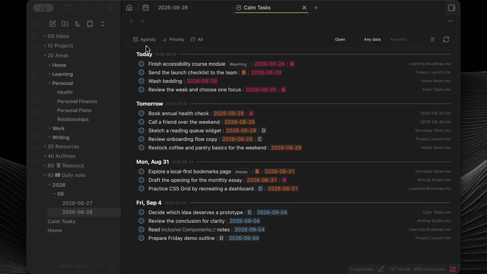

# Calm Tasks

[English](README.md) · **한국어**

Obsidian Vault의 여러 Markdown 파일에 흩어진 할 일을 한곳에 모아주는 조용한 작업 공간입니다.

[](docs/assets/calm-tasks-overview.mp4)

이미지를 클릭하면 73초 오버뷰 영상을 볼 수 있습니다.

Calm Tasks는 Org mode의 평문 중심 철학을 Obsidian에 맞게 더 작고 단순한 문법으로 옮겼습니다. 원본은 계속 Markdown 파일에 남고, 전용 작업 화면에서 할 일을 보기 좋게 정리하고 관리할 수 있습니다.

## 주요 기능

- 여러 Markdown 파일에 기록한 Task를 하나의 작업 화면에 모아 표시
- **Agenda**, **Priority**, 사용자 그룹을 제공하는 **All** 보기
- Task 생성, 제목 수정, 완료, 순서 변경, 그룹 이동과 다중 선택
- 드래그, 컨텍스트 메뉴와 설정 가능한 키보드 단축키
- 상태, 날짜, 태그, 키워드 필터와 Smart Filter 저장
- 한글 조합을 끊지 않는 짧은 지연 방식의 순간 검색
- 선택한 Task를 수정하는 하단 또는 우측 Details 패널
- 일반 Markdown 노트에서도 Task의 날짜와 우선순위를 자동으로 컬러 표시
- 설정한 일괄 보관 시간까지 완료 Task를 작업 화면에 유지
- 행 간격, 줄 높이, 색상과 작업 화면 전용 Custom CSS 설정

사용자 그룹을 삭제해도 Task는 삭제되지 않고 Inbox로 이동합니다.

## Task 문법

일반 Markdown 체크박스를 그대로 사용합니다.

```markdown
- [ ] 출시 브리프 준비
- [x] 회의실 예약
```

날짜와 우선순위는 Calm Tasks의 간단한 표기로 입력할 수 있습니다.

```markdown
- [ ] 출시 브리프 준비 | 2026-09-03 | A
- [ ] 백로그 검토 | B
- [ ] 병원 예약 | B | 2026-09-05
```

우선순위는 A부터 D까지이며 날짜와 우선순위의 순서는 바뀌어도 됩니다. `📅`, `🛫`, `🔁`과 우선순위 이모지 등 자주 쓰는 Obsidian Tasks 메타데이터도 인식하고 보존합니다.

인식된 날짜와 우선순위는 Calm Tasks 화면뿐 아니라 일반 Markdown 노트의 Task에서도 자동으로 컬러가 적용됩니다.

## 기본 조작

| 작업 | 조작 |
| --- | --- |
| 제목 수정 | Task 제목 클릭 |
| 다음 Task 추가 | 편집 중 Enter |
| 완료 또는 다시 열기 | 동그라미 클릭 |
| 범위 선택 | All에서 Shift+클릭 |
| 순서 변경 | 드래그 또는 위/아래 이동 명령 |
| 다른 그룹으로 이동 | Task 우클릭 또는 드래그 |
| 그룹 관리 | 그룹 제목 더블클릭 또는 우클릭 |
| 선택 해제 | 빈 영역, 탭 또는 필터 클릭 |

Obsidian에서 위/아래 이동 명령에 원하는 단축키를 지정할 수 있습니다. macOS에서는 Task 편집 중 `Control+Command+↑/↓`도 인식합니다.

## Daily Note

Daily Note의 Task도 다른 Markdown 파일과 똑같이 수집합니다. 끝내지 못한 Task를 `YYYY-MM-DD.md` 형식의 날짜 노트 사이에서 옮긴다면, 선택 기능인 **Preserve Daily Note placement**로 All 보기의 그룹과 순서를 유지할 수 있습니다. 이 설정은 기본적으로 꺼져 있습니다.

## 설치

### BRAT

BRAT을 설치한 뒤 **BRAT: Add a beta plugin for testing**을 실행하고 이 저장소의 URL을 입력합니다.

### 수동 설치

릴리스의 `main.js`, `manifest.json`, `styles.css`를 다음 폴더에 복사합니다.

```text
<vault>/.obsidian/plugins/calm-tasks/
```

Obsidian을 다시 불러오고 **설정 → 커뮤니티 플러그인**에서 Calm Tasks를 활성화합니다. 작업 화면에서 만든 새 Task는 기본적으로 Vault 루트의 `Calm Tasks.md`에 저장됩니다.

## 테마 호환성

Calm Tasks는 Minimal 테마와 개인 CSS 환경을 중심으로 테스트했습니다. 다른 테마에서는 작업 화면 Custom CSS 설정을 통한 작은 조정이 필요할 수 있습니다.

## 라이선스

Calm Tasks는 무료로 사용할 수 있습니다. 수정·파생 버전은 비상업적으로 사용할 수 있지만, 이를 상업적으로 이용하거나 판매 또는 유료 배포하려면 사전 허가가 필요합니다. 자세한 내용은 [LICENSE](LICENSE)를 확인하세요.

## 후원

Calm Tasks가 할 일을 정리하는 데 도움이 되었다면, 커피 한 잔으로 꾸준한 개발을 응원해 주세요.

[](https://buymeacoffee.com/sungikimi)
