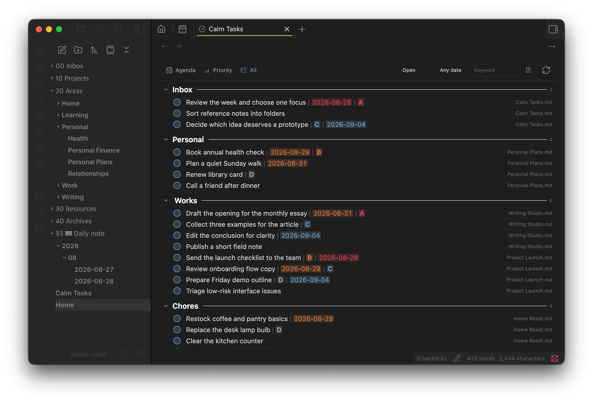

# Calm Tasks

**English** · [한국어](README.ko.md)

A quiet task workspace that collects Markdown tasks from across your Obsidian vault.

See the [website](https://sungikim.github.io/Calm-Tasks/) for a detailed introduction.

[](https://sungikim.github.io/Calm-Tasks/)

Click the screenshot to open the full introduction and overview video.

Calm Tasks borrows the plain-text spirit of Org mode, with a smaller syntax designed for Obsidian. Your Markdown files remain the source of truth, while the dedicated workspace gives you a clear way to organize and review them.

## Features

- Collect tasks written across multiple Markdown files into one workspace.
- Browse them by **Agenda**, **Priority**, or custom groups in **All**.
- Create, edit, complete, reorder, group, and multi-select tasks.
- Drag tasks or use context menus and configurable keyboard shortcuts.
- Filter by status, date, tag, and keyword; save combinations as Smart Filters.
- Search instantly after a short typing pause, including Korean IME input.
- Edit a selected task in the optional bottom or right-side Details panel.
- Color dates and priorities automatically in ordinary Markdown notes as well as the workspace.
- Keep completed tasks visible until the configurable daily archive time.
- Adjust spacing, line height, colors, and workspace-only Custom CSS.

Deleting a custom group does not delete its tasks; they return to Inbox.

## Task syntax

Ordinary Markdown checkboxes work as-is:

```markdown
- [ ] Prepare the launch brief
- [x] Book the room
```

Dates and priorities can use the compact Calm Tasks notation:

```markdown
- [ ] Prepare the launch brief | 2026-09-03 | A
- [ ] Review the backlog | B
- [ ] Book an appointment | B | 2026-09-05
```

Priority ranges from A to D. Date and priority may appear in either order. Common Obsidian Tasks metadata such as `📅`, `🛫`, `🔁`, and priority emojis is also recognized and preserved.

Recognized dates and priorities are colorized automatically when these tasks appear in regular Markdown notes.

## Basic controls

| Action | Control |
| --- | --- |
| Edit | Click the task title |
| Add the next task | Press Enter while editing |
| Complete or reopen | Click the circle |
| Select a range | Shift-click in All |
| Reorder | Drag or run the move up/down commands |
| Move to a group | Right-click a task or drag it |
| Manage a group | Double-click or right-click its title |
| Clear selection | Click an empty area, tab, or filter |

The move commands can be assigned to any hotkeys in Obsidian. On macOS, `Control+Command+↑/↓` is recognized while editing a task.

## Daily Notes

Tasks in Daily Notes are collected like tasks in any other Markdown file. If you move unfinished tasks between notes named `YYYY-MM-DD.md`, the optional **Preserve Daily Note placement** setting can retain their All-view group and order. This setting is off by default.

## Installation

### BRAT

Install BRAT, run **BRAT: Add a beta plugin for testing**, and paste this repository's URL.

### Manual

Download `main.js`, `manifest.json`, and `styles.css` from the release and copy them to:

```text
<vault>/.obsidian/plugins/calm-tasks/
```

Reload Obsidian and enable Calm Tasks under **Settings → Community plugins**. New workspace tasks are written to `Calm Tasks.md` in the vault root by default.

## Theme compatibility

Calm Tasks was built and tested primarily with the Minimal theme and a personal CSS setup. Other themes may need small adjustments through the workspace Custom CSS setting.

## License

Calm Tasks is free to use. Modified or derivative versions may be used non-commercially, but commercial use, sale, or paid distribution of them requires prior permission. See [LICENSE](LICENSE).

## Support

If Calm Tasks helps you stay organized, a small coffee helps keep its development going.

<a href="https://buymeacoffee.com/sungikimi"></a>
